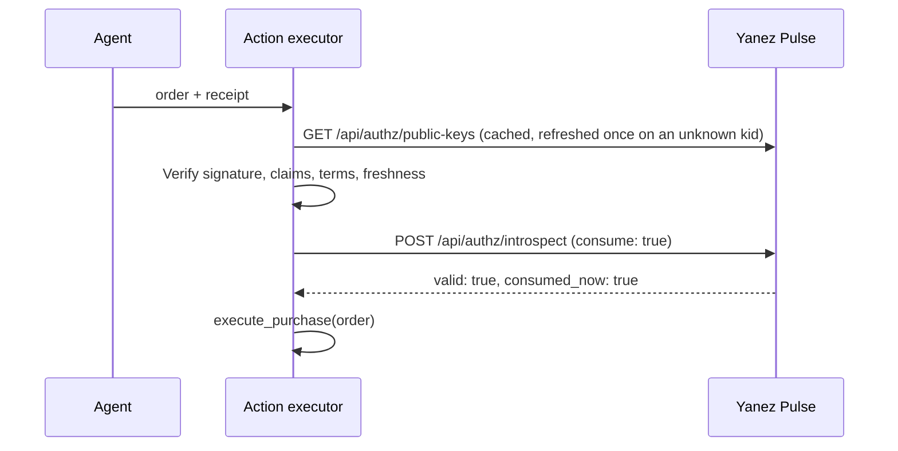

# Action enforcement

The enforcement boundary is the sensitive action executor — not the agent, not a
skill, not an MCP status field. A protected action must have **no unguarded path**:
its trusted API takes both the proposed action and the receipt.

```text
execute_purchase(order, yanez_receipt)
```



## The executor's checklist

1. **Reconstruct the expected terms** from `order`: your own inputs, not the agent's
   claims.
2. **Verify the receipt.**
   - *Transport and discovery.* Fetch the key set from `/api/authz/public-keys` on a
     base URL you configure, over HTTPS, without following redirects. Cache it, and on
     an unknown `kid` refresh it at most once per 30 s before rejecting.
   - *Key selection.* Pin `alg == "EdDSA"`, select the key by the header `kid` (never
     by algorithm), and skip any JWK entry with a missing or wrong `kty`, `crv`,
     `alg`, or `kid`.
   - *Issuer.* `iss` equals the exact string the Yanez operator publishes, taken from
     your own configuration.
   - *Claim profile.* All required claims are present; `yanez_decision == "approved"`;
     `sub`, `jti`, and `yanez_agent_key_id` are non-empty strings; `yanez_terms` is an
     object; `iat` and `yanez_decided_at` are equal integers not more than 60 s in
     the future; `yanez_match_overlap` is an integer `>= 0`; `yanez_consent_not_after`
     is an integer when present.
   - *Subject.* `sub` equals the YID entitled to act on this account (`expected_sub`).
3. **Verify the approver's own signature**, and check every field inside it against
   this receipt. This is the half a JWT library cannot do for you, and skipping the
   field checks makes the signature check decorative:
   [verifying, step by step](user-signed-approvals.md#verifying-step-by-step).
4. **Compare terms.** `yanez_terms` equals the expected terms structurally, and equals
   the terms inside the signed message. No ignored fields, no wildcards.
5. **Apply your freshness policy.** Refuse when `now - yanez_decided_at > max_age`.
6. **Honor the declared consent bound.** Refuse when `now > yanez_consent_not_after`.
7. **Apply your assurance floor.** Refuse when `yanez_assurance_tier` is below what the
   value at risk warrants. A `low`-tier approval is genuine; whether it is enough is
   your decision, and nobody else's.
8. **Consume, for single-use actions**, immediately before executing:
   `POST /api/authz/introspect {"artifact": ..., "consume": true, "consumer_token": ...}`,
   and proceed only on `consumed_now: true`. Write the token and an idempotency key
   derived from `jti` durably **before** the call.

<div class="callout callout-warn" markdown="1">
<div class="callout-title">Two common mistakes in step 2</div>
Selecting a key by algorithm instead of by `kid`, and reading `iss` from the unverified
token and then "verifying" against it. The expected issuer is your own configuration;
the SDKs make it a mandatory constructor argument.
</div>

## Using the SDK

Both SDKs package steps 2 through 8 as one call:

```python
from yanez_authz import ReceiptVerifier

verifier = ReceiptVerifier(
    base_url=base_url,                # configured, never taken from the receipt
    expected_issuer=expected_issuer,  # configured, never taken from the receipt
)

# Steps 2-8: verify both signatures, compare terms, apply time and tier policy, consume.
receipt = verifier.authorize_action(
    artifact,
    expected_terms,                   # rebuilt from the order, not from the agent
    max_age_seconds=900,
    consume=True,
    consumer_token=job.consumer_token, # yours, durable, reused on every retry
    expected_sub=order.approver_yid,  # the YID your records tie to this account
    min_assurance_tier="high",        # your floor for the value at risk
)

# Only reachable if authorize_action returned.
execute_purchase(order, idempotency_key=job.idempotency_key)
```

`authorize_action` raises `ReceiptVerificationError` (or its subclass
`UserSignatureError`, when the approver's own signature is what failed),
`ConsentPolicyError`, `AlreadyConsumedError`, or `ReservationHeldError` when a check
fails, and `TransportError` when Yanez cannot be reached. On all of them except
`ReservationHeldError`, do not act — see
[recovering a lost consume](user-signed-approvals.md#recovering-a-lost-consume). The verifier refuses plain HTTP outside loopback,
does not follow redirects, and caches the key set for ten minutes. Both SDKs apply the
same checklist and reach the same verdicts on the shared conformance fixtures.

## Bind the receipt to the account

A genuine receipt proves that *some* YID approved these terms. Naming the account
inside the terms does not change that: any user could approve terms that mention
someone else's account. Always establish who approved, by passing `expected_sub` (the
YID your own records tie to the account) or by resolving `receipt.sub` against those
records before acting. `expected_agent_key_id` additionally pins which agent key asked.

## What is never authorization

- An agent-generated boolean.
- Prose such as "the user approved".
- Decoded but unverified JWT claims.
- A verified Yanez signature with the approver's own signature left unchecked.
- An MCP tool result.

## Replay and single use

Offline verification alone does not prevent replay: single-use actions consume, or
keep an equivalent relying-party `jti` ledger. If the external action fails after
consumption, the receipt stays spent, and a retry requires a new authorization. Yanez
cannot make consumption and a third-party side effect one atomic transaction.

## Introspection responses

Signature, claim profile, and time bounds are checkable offline. Single use is not, and
that is the one job of `POST /api/authz/introspect`. It answers two separate questions:
`valid` says whether the receipt is genuine, and that answer does not change with time
while the deployment's issuer and key configuration stay the same. `reason` and
`consumed_now` say whether it can be acted on now.

| `valid` | `reason` | `consumed_now` | Meaning and executor action |
|---|---|---|---|
| `false` | `"bad_signature"` | — | <span class="badge badge-no">Do not act</span> Signature, issuer, required claims, or profile check failed. Not a receipt. |
| `true` | — | `null` | <span class="badge badge-no">Do not act</span> Genuine, but `consume` was false, so nothing was reserved. Not enough on its own. |
| `true` | — | `true` | <span class="badge badge-ok">Act now</span> Genuine, and this call spent it. |
| `true` | `"consent_expired"` | `false` | <span class="badge badge-no">Do not act</span> Genuine, but `yanez_consent_not_after` has passed. Not consumed. Request a new approval. |
| `true` | `"already_consumed"` | `false` | <span class="badge badge-no">Never act</span> Genuine, but another holder already spent it. |
| `true` | `"reservation_held"` | `false` | <span class="badge badge-ok">Reconcile</span> **You** already hold it, from an attempt whose response was lost. The action may already have happened: re-send or query downstream with your ORIGINAL idempotency key. Never re-approve. |

Every `valid: true` response also returns the decoded `sub`, `jti`, `decided_at`,
`consent_not_after`, `terms`, and the proof claims, so you read one shape whether or not
you can act. Those proof fields are the issuer's report of the claims, not an
independent check: verifying the user's signature is local work that no round trip can
do for you.
Consumption is permanent and deployment-wide: a spent `jti` never re-arms, because a
receipt that verifies forever must stay spent forever.

<div class="callout callout-warn" markdown="1">
<div class="callout-title">Receipts are bearer proof</div>
Consumption needs no credentials, so anyone who holds a receipt can spend it and deny
the legitimate executor the action. Never log a receipt, never put one in a URL or
query string, and send it only over TLS.
</div>

<div class="callout callout-warn" markdown="1">
<div class="callout-title">A lost consume response is recoverable now</div>
Act only when the consume response says `consumed_now: true`. When that response is lost
to a timeout or a reset, retry **with the same `consumer_token`**: `reservation_held`
means your own earlier attempt won, and `already_consumed` means someone else did. That
distinction is the whole reason the token is caller-supplied, and it is why the server
never generates one — a server-minted token would be lost along with the response it
travelled in.

On `reservation_held`, reconcile the downstream action with your original idempotency
key. Requesting a new approval there mints a second `jti` for an action that may already
have succeeded, and the duplicate is invisible to every consumption check.
</div>
